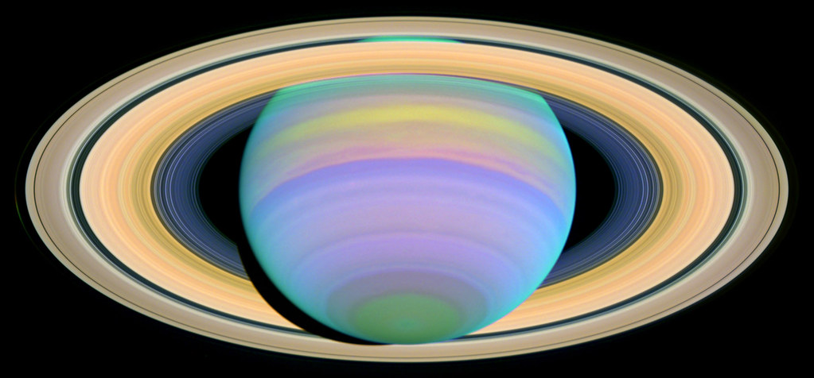

# My Quick Static Site

This is a site I build with gh-pages. **Wow**

It reads [markdown](https://www.markdownguide.org/) and turns it into html.

---

# **Markdown Conventions**
# [Log File](https://dandamanqq.github.io/Log)
## **Favourite Academic Work:**

I, Daniel Totev am currently enrolled in Computer Science and I am in fourth
year. A piece of work that I have worked on and really enjoyed was in a course
called Computer Vision.

* In the Computer Vision course, I did a project where I am detecting STOP signs
contained in pictures and video frames. I have successfully computed a trained
AI model with a dataset containing pictures with STOP signs and without. Any
picture that is being passed in the program with a STOP sign should be detected
and there will be a box identifying the STOP sign. The program can also run real
time if the user has the camera turned on. Once the code compiles and runs with
the feature for recognizing STOP signs in real time with a camera, any picture
with a STOP in a video will be recognized and traced with a box. Even if the
STOP is moving in the video, the box highlighting the STOP sign will still be
tracing it actively. Some key findings that I found were that training the AI
to recognize STOP signs in pictures can take a very long time.

_Here are some images from the project:_

+ 

I personally really enjoyed this class and it was one of my favourite classes
during my 4 years at Carleton. This project was fun and was super interesting.

## **Creative Common Images:**
1. My favourite planet is _Saturn:_

2. _My favourite instrument is the guitar and I have played it since I was only
6 years old:_

3. _My favourite sport is tennis and I have played since I was 6 years old as
well. I also really love the brand Wilson._

4. _I really love cars and have a passion for speed. The Lamborghini Huracan is
my favourite supercar._

This is a hyper link to the [Github Markdown page](https://github.com/adam-p/markdown-here/wiki/Markdown-Cheatsheet) which was very useful.

This is a hyper link to the [Atom](https://atom.io/) website which is where I installed Atom.

## **Creating a Table:**

_Ranking Sports from 1 to 10 in my opinion:_

| Sports        | Ranking (1 - 10)|        
| ------------- |:---------------:|
| Tennis        |        10       |          
| Soccer        |         9       |          
| Hockey        |         3       |    
| Golf          |         7       |          
| Swimming      |         8       |          
| Lacrosse      |         2       |
